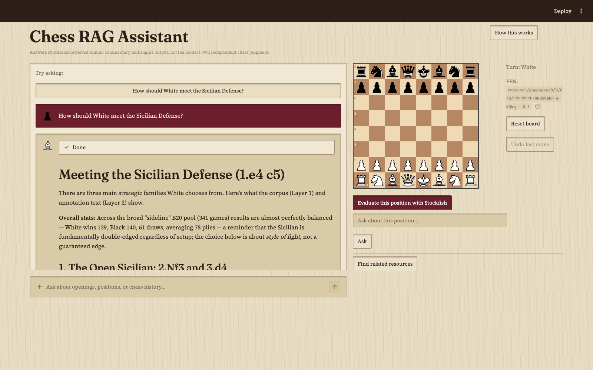
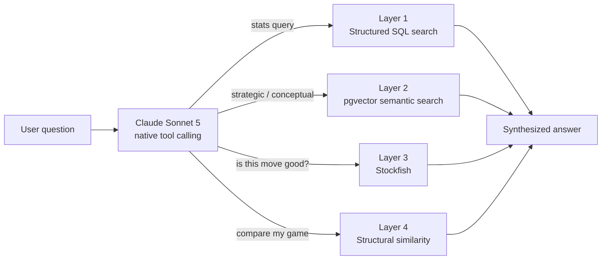

# Chess Scholar

A chess research assistant that routes every question across four independent backends: SQL statistics, semantic search over annotated commentary, a real chess engine, and structural game similarity, through the LLM's own native tool calling rather than a hand-rolled classifier or a RAG framework.

[](https://github.com/blakegrudzien/chess-rag/actions/workflows/ci.yml)


**Live demo:** [chess-rag-blake.streamlit.app](https://chess-rag-blake.streamlit.app/)



## What this is

Most "chat with your data" projects pick one retrieval strategy and stick to it. Chess questions do not fit one strategy. "How often does White play this recapture" is a SQL aggregation. "What's the plan behind an isolated queen pawn" is a semantic search over strategic commentary. "Is this move actually good" cannot be answered by an LLM's intuition at all; it needs a real engine. "Does my game resemble a known one" is a structural comparison, not a text search.

There is also a deeper reason a chess engine alone cannot fill this role. Stockfish evaluates a position by searching millions of candidate lines and returning a centipawn score and a best move; it has no concept of a "plan" and no way to explain, in words, why a move is right. That explanatory layer, the actual language of chess instruction, only exists in text a human wrote: annotated games, opening theory, strategy books. An engine call answers whether a move is good. A semantic search over annotated commentary answers why. Neither substitutes for the other, which is the real reason Layers 2 and 3 are separate systems here rather than one.

This project treats that as the actual problem: given a natural-language question, decide which of several structurally different backends (or which combination) can answer it, then synthesize a single coherent response. The routing is not a keyword matcher or an intent classifier trained for the purpose. It is Claude Sonnet 5's own tool-calling, given four tools and a system prompt describing when each applies, deciding for itself which to call, in what order, and how many times. Read the *why* behind that choice in [Design decisions](#design-decisions-worth-noting) below.

The result is a chat interface, a draggable board that stays in sync with whatever position the conversation is discussing, and two supporting features built on the same corpus: point-in-time evaluation against Stockfish, and an "illustrative comparison" that matches an uploaded game's opening moves against 127,000 games of the master-level corpus.

## Architecture



| Layer | What it answers | How |
|---|---|---|
| **1. Structured search** | "How often", "where does this piece usually go", opening statistics | Deterministic SQL over `games`/`moves` (127,435 games, 10.2M moves). No LLM judgment involved; the query either returns the right count or it doesn't. |
| **2. Vector RAG** | "What's the plan behind X", strategic and conceptual questions | pgvector similarity search over 468,862 annotation chunks (voyage-4 embeddings, 1024-dim), sourced from ChessBase master-game annotations. |
| **3. Stockfish** | "Is this move good", "what's the best reply" | Real UCI engine evaluation, run through a small pool of engine subprocesses so concurrent requests get genuine parallelism instead of queuing behind one process. The model is explicitly instructed never to judge tactical soundness on its own; every such claim has to cite an engine call. |
| **4. Structural similarity** | "Have I played into a known game" | Opening-move-prefix matching against the corpus from an uploaded PGN. Deliberately labeled "illustrative," not authoritative: it matches on exact move sequences, not positional understanding. |

A fifth capability sits alongside the four layers rather than inside them: a small, separate agent (`src/recommendation/`) that decides whether a Lichess study or a corpus game is worth surfacing alongside an answer. A trained gradient-boosted classifier (0.887 cross-validated ROC-AUC on 184 hand-labeled examples) filters a pool of scraped Lichess studies down to the ones worth ever showing, before any of them become searchable.

## The corpus

| | |
|---|---|
| Games | 127,435 (ChessBase-sourced master games) |
| Moves | 10,206,184 |
| Annotation chunks | 468,862, all embedded |
| Opening codes represented | 500 (the full ECO range) |
| Date range | 1610 to 2023 |
| Lichess study pool | 245 studies, quality-filtered from a larger scraped candidate set |

## Recommendation quality classifier

Lichess studies vary enormously in quality, and popularity (likes, member count) is a weak proxy for whether a study is actually worth recommending alongside a chat answer. A gradient-boosted classifier (`scripts/train_quality_classifier.py`) is trained on structural features extracted from each study (chapter count, annotation density, comment length, NAG annotation count, and similar) against 184 examples hand-labeled "recommend" or "reject", and filters the scraped candidate pool down to the subset that ever becomes searchable at all.

Two candidate models (logistic regression and gradient-boosted trees) are compared via 5-fold cross-validation and selected by ROC-AUC rather than accuracy, since the downstream use is ranking candidates by predicted quality, not classifying against one fixed threshold. Metrics below are the winning model's cross-validated performance, broken out by genre and game phase; any subgroup with fewer than 10 examples, or fewer than 5 of the minority class, is left out rather than reported on numbers too small to mean anything.

| | n | Accuracy | Precision | Recall | F1 | ROC-AUC |
|---|---|---|---|---|---|---|
| **Overall** | 184 | 0.810 | 0.777 | 0.839 | 0.807 | **0.887** |
| Concept genre | 156 | 0.808 | 0.762 | 0.865 | 0.810 | 0.884 |
| Drill genre | 28 | 0.821 | 0.900 | 0.692 | 0.783 | 0.949 |
| Opening phase | 87 | 0.747 | 0.579 | 0.786 | 0.667 | 0.807 |
| Middlegame phase | 13 | 0.692 | 1.000 | 0.500 | 0.667 | 1.000 |
| Endgame phase | 16 | 0.750 | 0.857 | 0.667 | 0.750 | 0.921 |
| General phase | 31 | 0.935 | 0.778 | 1.000 | 0.875 | 0.964 |

The training set excludes one genre entirely: every narrative-genre label collected came back "reject," so training on it would teach the model a pattern it would never be asked to apply again, a train/serve skew avoided by leaving that genre out up front rather than filtering it after the fact. A separate, independent likes floor (`MIN_LIKES_FOR_RECOMMENDATION`) gates recommendations too: a study the classifier scores well can still be too obscure to serve, since almost nobody having seen it is a different risk than the classifier's own accuracy addresses.

## Design decisions worth noting

A few choices in this codebase were deliberate enough to be worth explaining rather than leaving implicit.

- **No LangChain or LlamaIndex.** Retrieval logic here is raw SQL and direct API calls. That is a slower way to build a RAG pipeline and a much easier one to actually explain: every retrieval step in this project can be pointed to in source, not gestured at through a framework's abstraction.
- **Tool calling instead of a routing classifier.** An earlier design routed questions through a hand-tuned classifier before deciding which backend to query. It was dropped in favor of trusting the model's own tool-calling judgment, the same pattern used throughout Anthropic's own agent guidance: give the model well-described tools and let it decide, rather than building a second, weaker model whose only job is to imitate that decision.
- **python-chess, not chessboard.js, is the source of truth for move legality.** The draggable board is a custom `st.components.v2` component wrapping chessboard.js purely as a visual and drag layer. Every drop is optimistically shown, then validated server-side against python-chess; an illegal drop snaps back with no separate JavaScript-side legality logic to keep in sync with the Python engine.
- **A concurrent-evaluation tool, added after a real reported slowness.** Comparing several candidate moves used to mean one sequential Stockfish call per candidate, each a full model round trip. A `compare_candidate_moves` tool runs the candidates against a pool of engine subprocesses in parallel instead, cutting a multi-minute comparison down to roughly the cost of evaluating one move.
- **Every external call that can fail, does get caught.** An unauthenticated app talking to three paid external APIs (Anthropic, Voyage, Lichess) plus a free-tier Postgres instance will eventually see a rate limit, a dropped connection, or a timeout. Those are caught explicitly and shown as a plain retry message, not a raw Python traceback (`showErrorDetails = "none"` in production, with full detail still reaching structured logs).
- **A session-local rate limit, not a global one.** Eight requests per minute per browser session, checked before a question ever reaches the model. It will not stop a determined attacker opening fresh sessions, but it does stop the far more likely case of a stuck retry or an accidental double-click, without penalizing every other concurrent visitor the way a shared counter would.

## Known limitations

Stated here deliberately rather than left to be discovered:

- Chat answers synthesize retrieved human commentary and engine output. They are not the model's own independent tactical judgment, and the model is explicitly instructed not to present them as one.
- The "find similar games" comparison (Layer 4) matches on exact opening move sequences, not positional understanding. It is an illustrative, approximate comparison, not a rigorous one.
- The recommendation pool's quality classifier was trained on 184 hand-labeled examples by a single labeler. It is a reasonably capable filter, not a large-scale model.
- The interface is built for a desktop-sized viewport. It has not yet been adapted for mobile; the board component in particular assumes real horizontal space.
- Trend synthesis across time periods (openings gaining or losing popularity by decade) is designed for in the schema but not yet built end to end.

## Tech stack

| Concern | Choice | Why |
|---|---|---|
| LLM | Claude Sonnet 5, native tool calling | Primary reasoning and routing engine across all four layers |
| Embeddings | Voyage AI `voyage-4` | Anthropic's recommended embeddings partner; Anthropic has no first-party embedding model |
| Database | Postgres + pgvector (Neon) | One database for both relational corpus data and vector search, on a free tier that still supports a live public demo |
| Engine | Stockfish via `python-chess` UCI integration | Ground-truth evaluation, pooled across subprocesses for concurrency |
| Frontend | Streamlit | A draggable board component wraps chessboard.js as a custom `st.components.v2` component; everything else is server-rendered Streamlit |
| Linting/formatting | ruff | One tool instead of a black/flake8/isort combination |

## Running locally

```bash
git clone https://github.com/blakegrudzien/chess-rag.git
cd chess-rag
pip install -e ".[dev]"
cp .env.example .env   # fill in DATABASE_URL, ANTHROPIC_API_KEY, VOYAGE_API_KEY, STOCKFISH_PATH

psql "$DATABASE_URL" -f scripts/init_db.sql
streamlit run src/app.py
```

The live demo's corpus is not included in this repository (ChessBase exports are licensed content; see [Data sources](#data-sources)). Running locally against an empty database will start the app, but most questions will have nothing to draw on until a corpus is ingested through `src/ingestion/`.

### Data sources

Master game annotations are exported from ChessBase 17 under the author's own license and are not redistributed here. Any book-length text ingested for Layer 2 is public domain (Project Gutenberg, archive.org) when committed to this repository; anything under modern copyright stays local and gitignored, never distributed.

## Testing

241 tests, run against both Python 3.11 and 3.12 in CI. A handful require a local Postgres with pgvector and self-skip with a clear reason when one is not available; CI itself provisions both, so a passing build always exercises the real thing, including the database schema's own constraints, not just mocked versions of it.

The suite leans toward regression tests for real, previously-reproduced bugs (a dropped database connection mid-session, a PGN upload malformed enough to crash a naive parser, a concurrent evaluation race) rather than only happy-path coverage.

```bash
pytest -v tests
ruff check . && ruff format --check .
```

## License

MIT. See [LICENSE](LICENSE).
